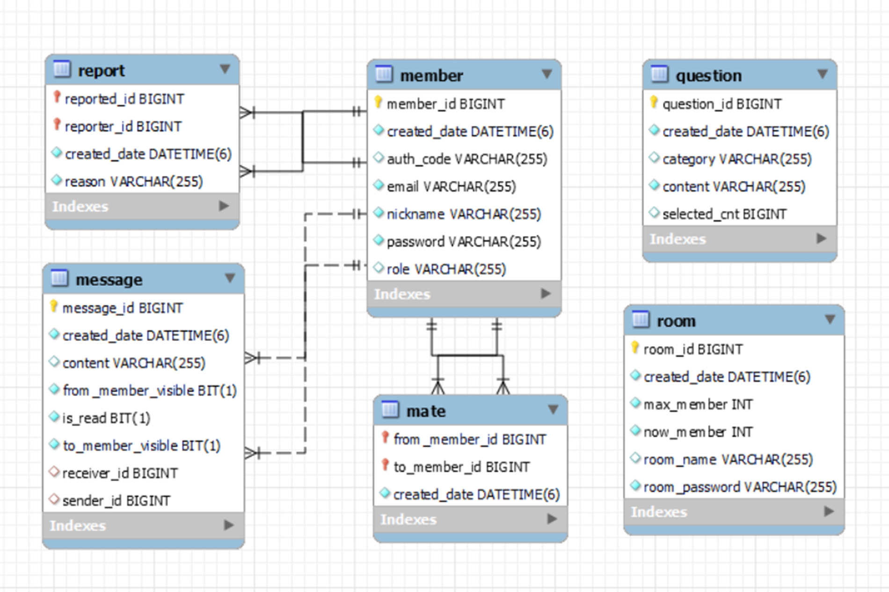
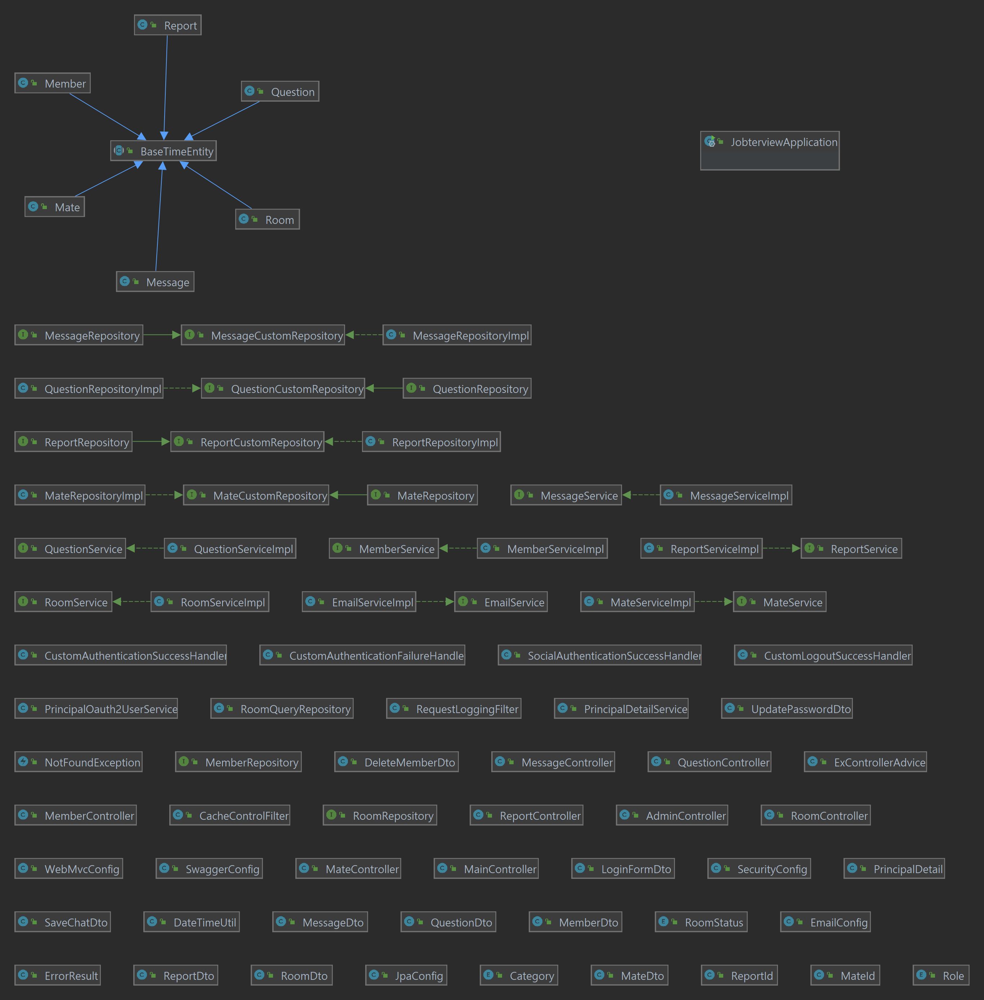
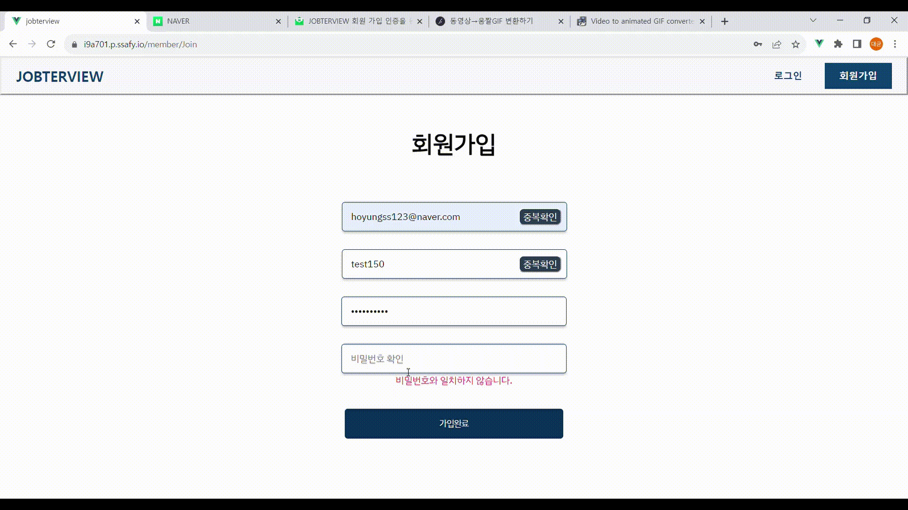
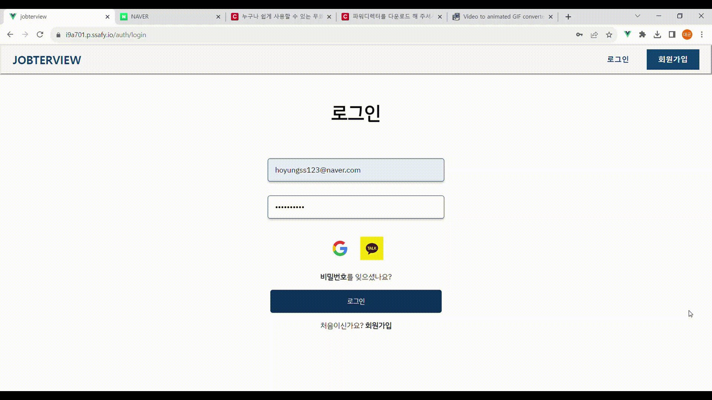
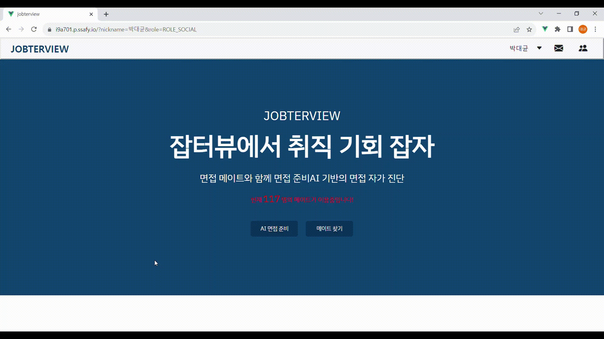
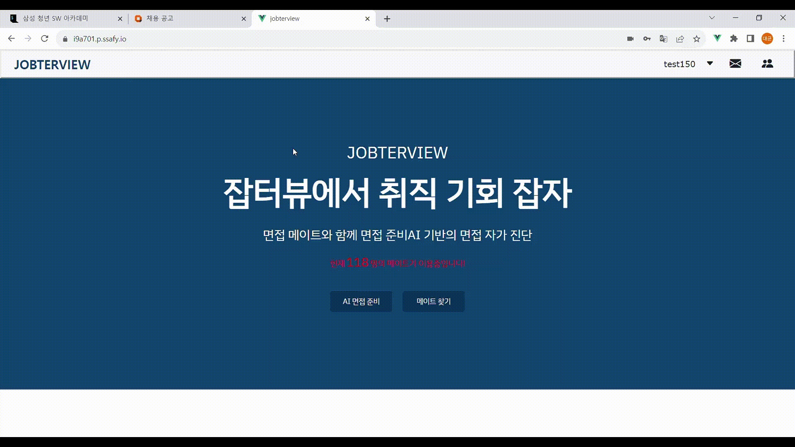
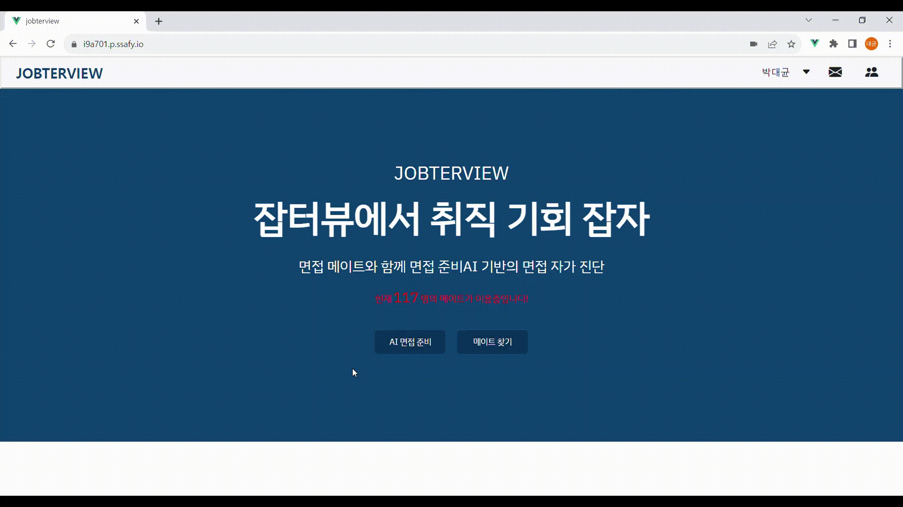

# 🍪JOB터뷰 Final 명세서

## 1. 요구사항 정의서 (Usercase Diagram)

- 회의룸
  - 모든 회의룸 목록 (getRoomList)
  - 특정 회의룸 검색 (searchRoomsByName)
  - 회의룸 중복 검사 (getRoomByName)
     

- 회원
  - 로그인 (login)
  - 소셜 로그인 (oauth2Login)
  - 로그아웃 (logout)
  - 회원가입 (join)
  - 회원 탈퇴 (quit)
  - 아이디 중복 체크 (checkByEmail)
  - 닉네임 중복 체크 (checkByNickname)
  - 비밀번호 수정 (updatePassword)
  - 마이페이지 (myInfo)
  - 이메일 인증(emailConfirm, emailAuth)
     

- 메세지
  - 받은 메세지 목록 (getFromMessageByNickname)
  - 보낸 메세지 목록 (getToMessageByNickname)
  - 메세지 작성 (sendMessage)
  - 메세지 상세 보기 (readMessage)
  - 받은 메세지 삭제 (fromMessageDelete)
  - 보낸 메세지 삭제 (toMessageDelete)
     

- 메이트
  - 메이트 신청 (makeMate)
  - 메이트 취소 (breakMate)
  - 메이트 목록 (findAllByMateWithPaging)
  - 특정 메이트 검색 (searchByKeyword)
     

- 관리자
  - 전체 회원 목록 (findAllMember)
  - 전체 회원 수 (getAllMemberCnt)
  - 회원 검색 (searchByEmail, searchByNickname)
  - 신고 유저 처리 (activeUpdate)
     

- AI 면접 분석
  - 사용자 영상 분석 (process_video_and_audio)

---

## 2. 테이블 구조도 (ERD)

---

## 3. Class Diagram

---

## 4. 시연

## 👪참여자

😺 SSAFY 9기 강수창(팀장)

😎 SSAFY 9기 정태희(부팀장)

🐻 SSAFY 9기 이상우(팀원)

🐮 SSAFY 9기 박대균(팀원)

🤖 SSAFY 9기 유진욱(팀원)

🐼 SSAFY 9기 이경호(팀원)

